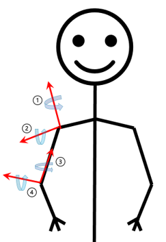

# Upperlimb-Localization
The project is developed in Windows 10 Operating System by Python 3.7.9

Refer to:

https://github.com/google/mediapipe  
https://github.com/pupil-labs/apriltags  
https://github.com/Razg93/Skeleton-Tracking-using-RealSense-depth-camera

Depends on mediapipe, pupil_apriltags, pyrealsense2, keyboard

`pip install pyrealsense2`

`pip install mediapipe`

`pip install pupil_apriltags`  

## Building executable
An executable can be built using pyinstaller:
`pyinstaller main.spec`

## Degree of Freedom (DoF):  
  
DoF1 Plane of Elevation  
DoF2 Elevation  
DoF3 Internal/External  
DoF4 Extension/Flexion  

## Coordinate System 
The camera coordinate system has the origin at the center of RGB imager. The y-axis points from the imager out the lens. The x-axis is to the right in the image taken by the camera, and z is upward. The Robotic coordinate frame is centered at the center of the tag, with x-axis into the tag, y-axis to the left, and z-axis upward.

